# UniEnter 画面一覧(自動生成)

`scripts/screenshots.sh` で生成。**このファイルと配下のPNGは手で編集しない**
(実行のたびに同じファイル名で上書きされる = 常に最新)。

全 20 枚。撮影対象を増やす場合は `UniEnter/Debug/ScreenshotMode.swift` の
`allShots()` に追記する。

> メニューバーのドロップダウン(NSMenu)はOSが描画するため、この方式では撮影できない。

| 画面 | ライト | ダーク |
| --- | --- | --- |
| オンボーディング(アクセシビリティ許可の誘導) | 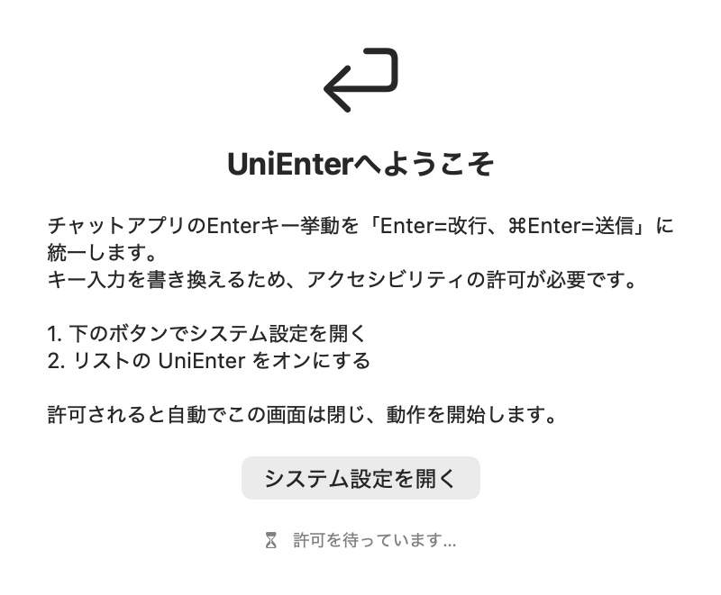 | 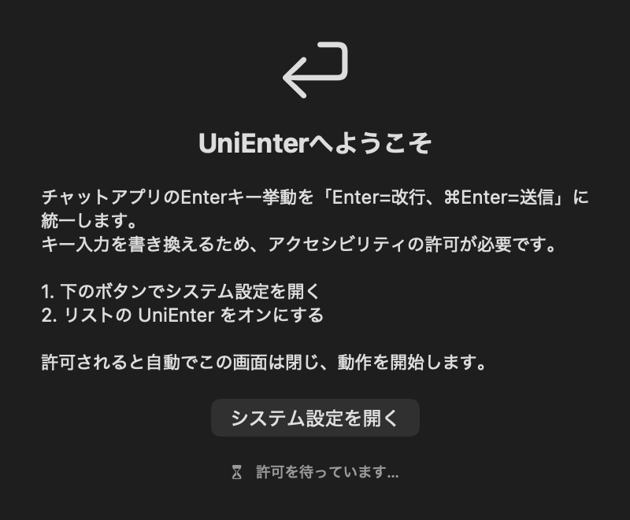 |
| オンボーディング(10秒経過後に出るトラブルシューティング付き) | 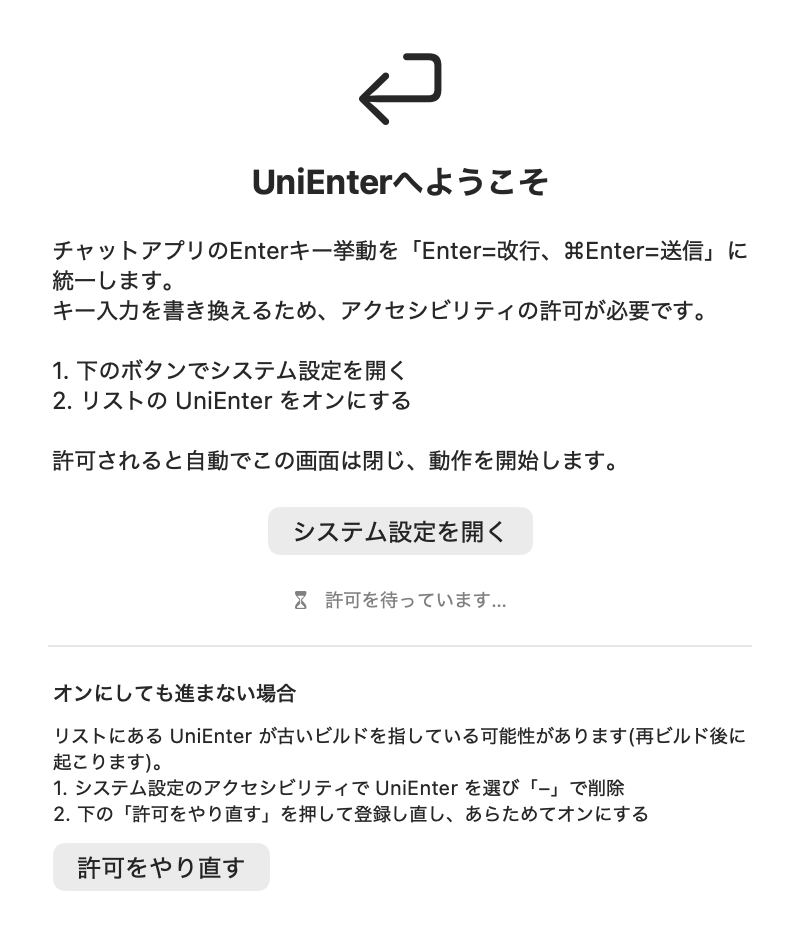 | 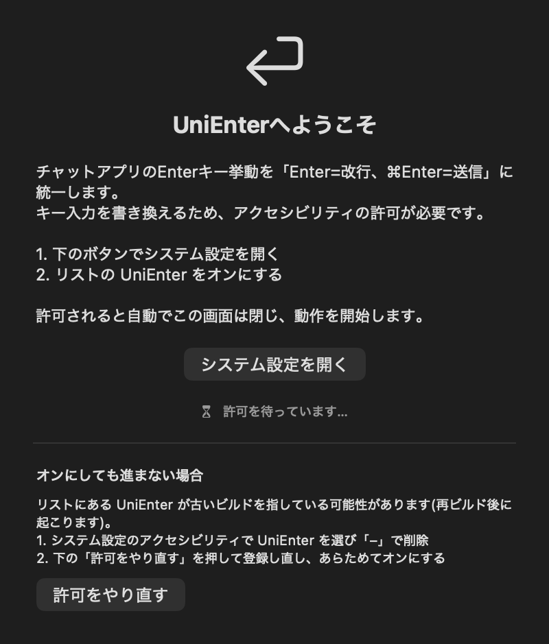 |
| チュートリアル 1/3 — 覚えるのは2つだけ | 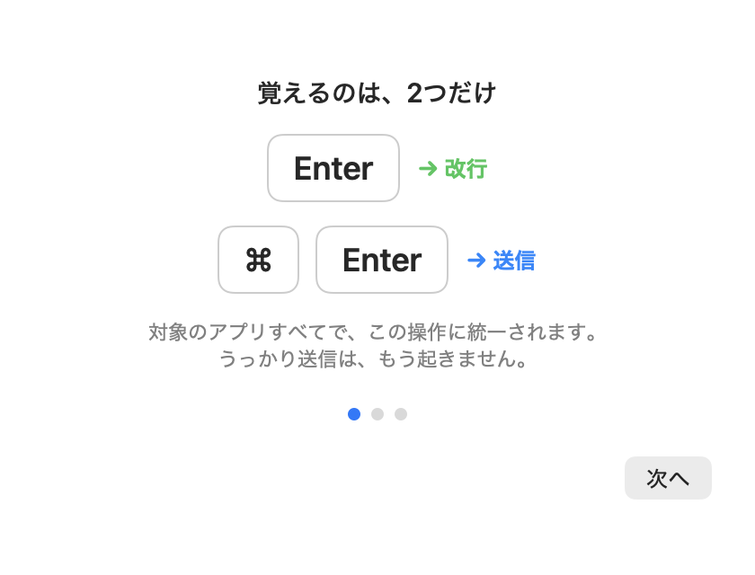 | 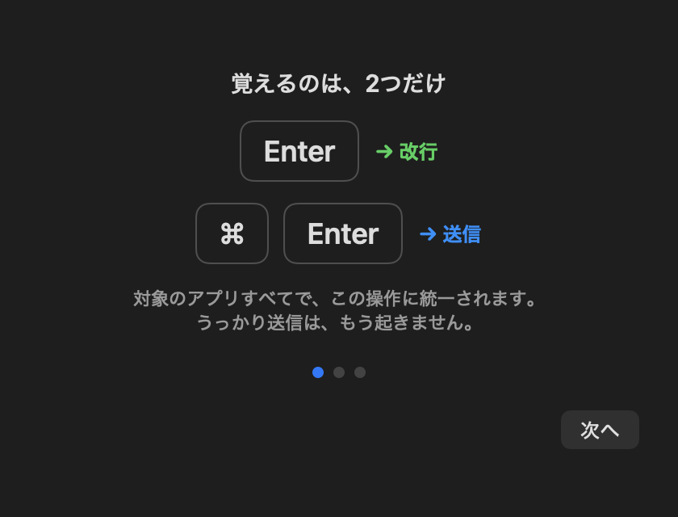 |
| チュートリアル 2/3 — 対象アプリ | 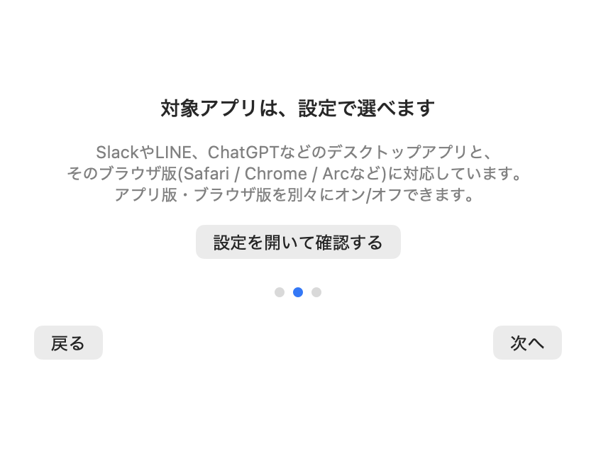 | 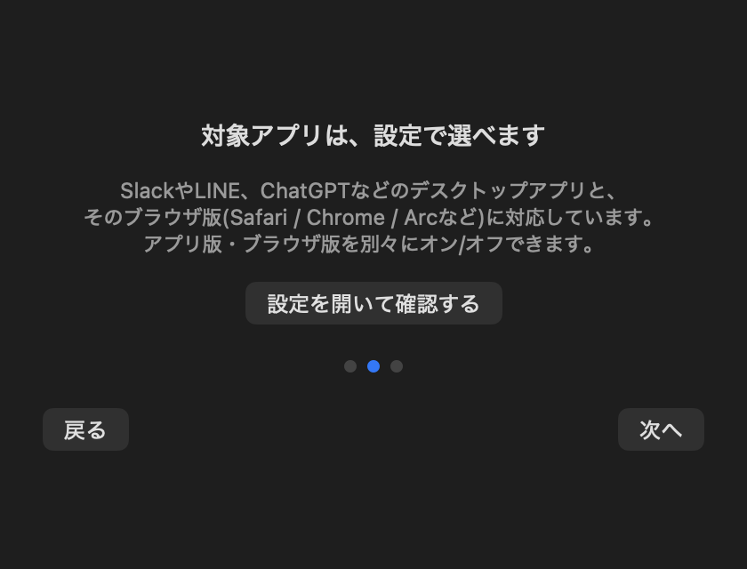 |
| チュートリアル 3/3 — 日本語入力の安全性 | 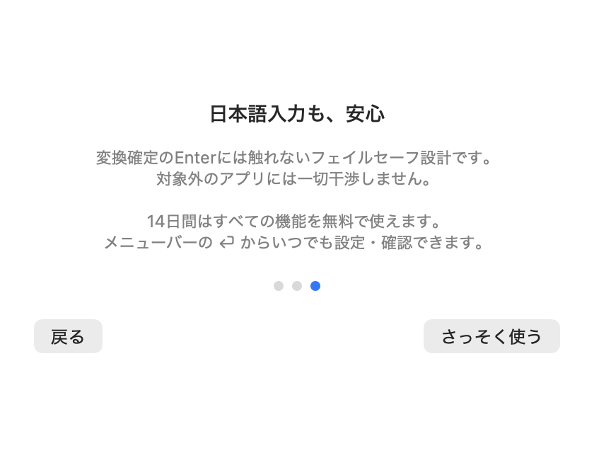 | 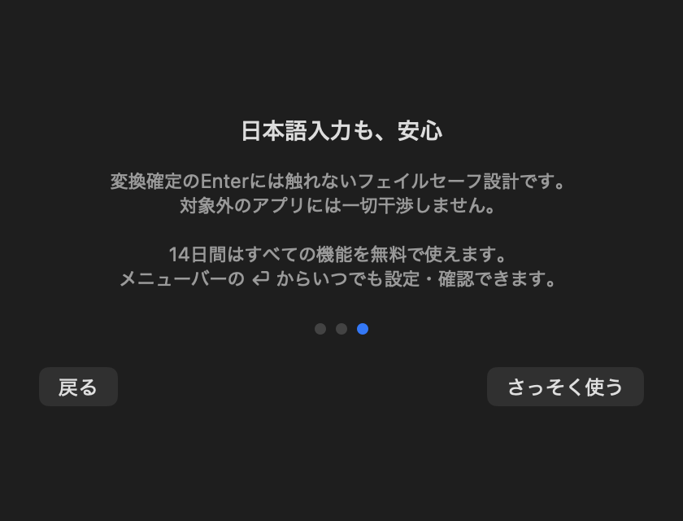 |
| 設定(既定状態) | 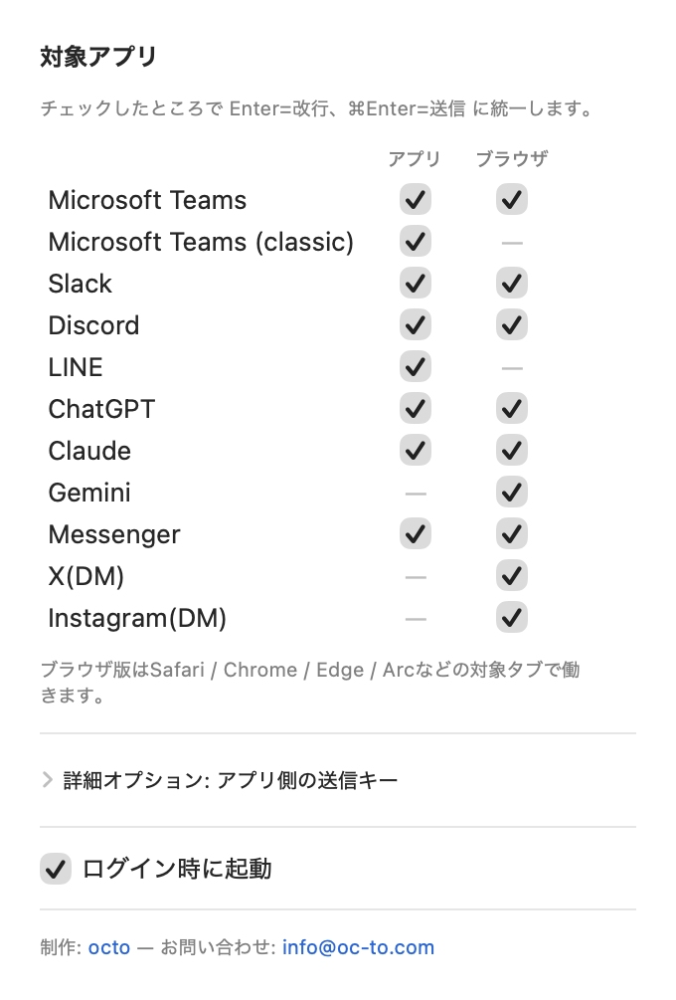 | 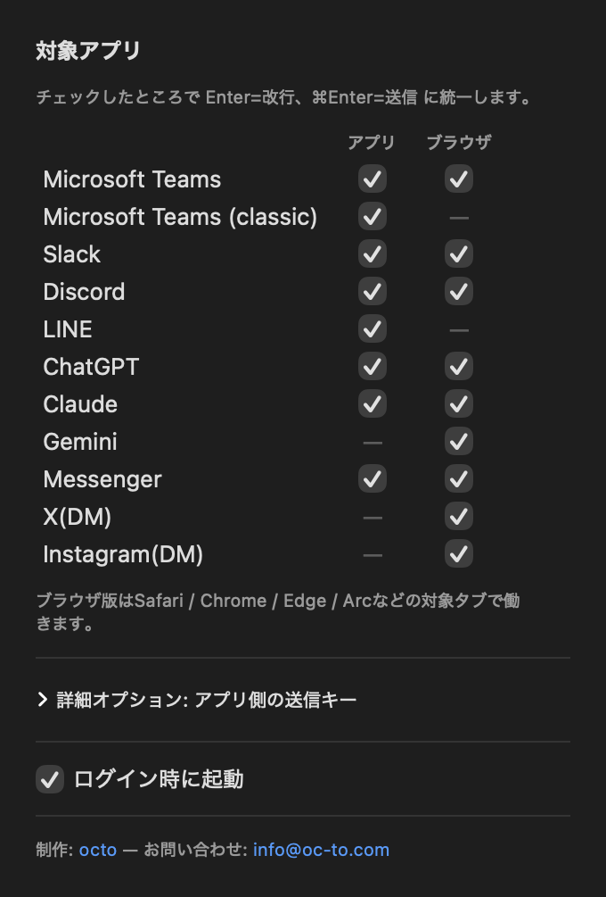 |
| 設定(詳細オプション: アプリ側の送信キー を展開) | 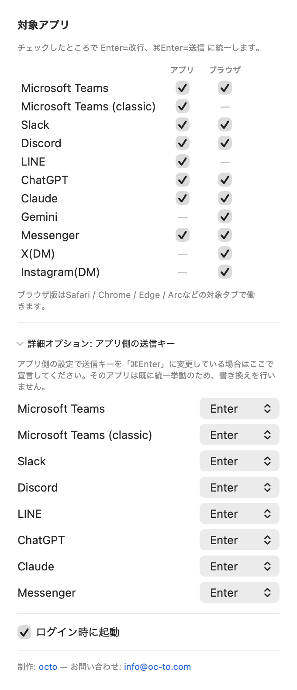 | 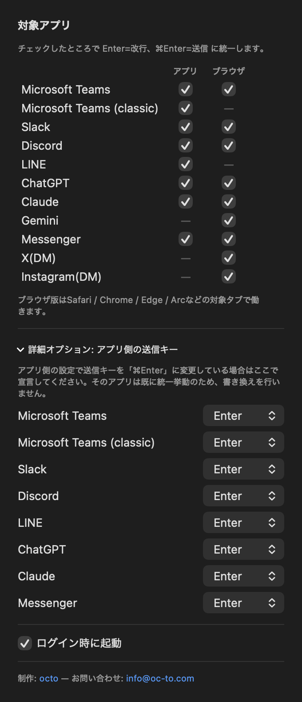 |
| ライセンス(トライアル中・残り11日) | 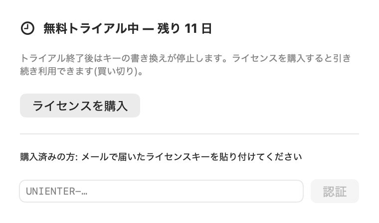 | 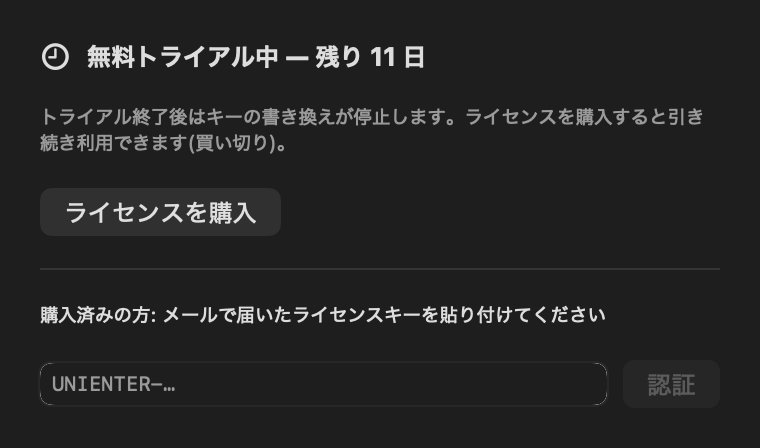 |
| ライセンス(トライアル終了・書き換え停止中) | 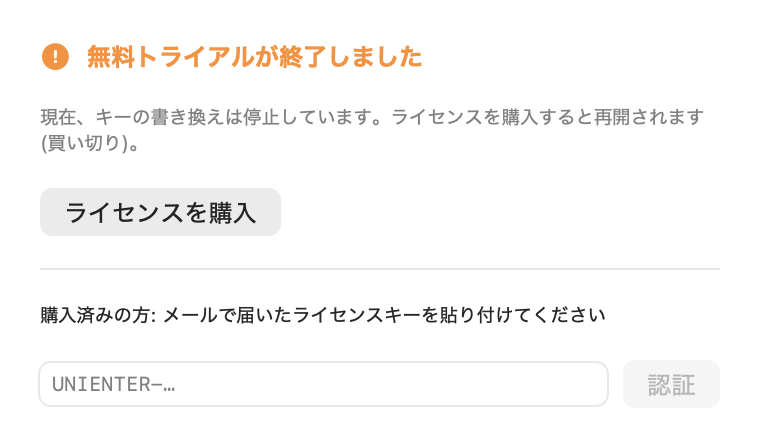 | 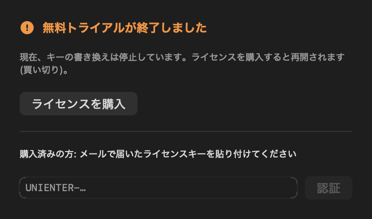 |
| ライセンス(認証済み) |  |  |